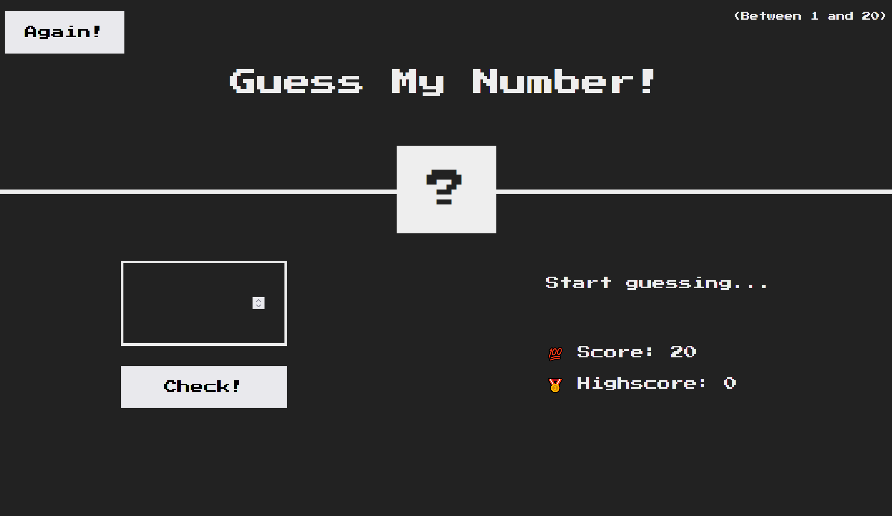

# Guess my number game!

This is a small project made throughout Jonas Schmedtmann's JavaScript course (https://www.udemy.com/course/the-complete-javascript-course).

You can see the web project here:

To win the game you have to figure out what number is hidden behind the '?', between 1 and 20.

For this project I used HTML, CSS and JavaScript, but the main purpose was to improve my JS skills. Some functional aspects implemented with JS are the following:

- When you hit the check button, if the number is higher or lower than the secret number, a message will show and the score decrease.

- If you guess the number, the screen will become green and the secret number appears.

- If the score is better than the previous one, it is saved as your highest score.

* When you hit the button 'Again', a new game will start and the screen will be set as default.
